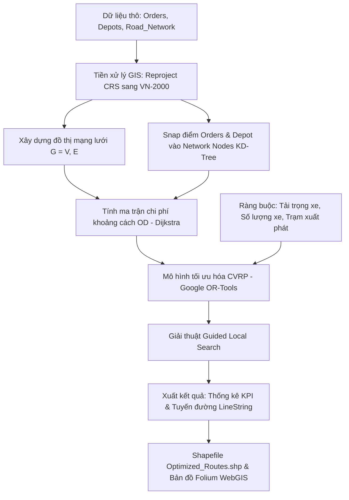

# ỨNG DỤNG HỆ THỐNG THÔNG TIN ĐỊA LÝ (GIS) VÀ THUẬT TOÁN ĐỊNH TUYẾN XE CÓ RÀNG BUỘC TẢI TRỌNG (CVRP) TRONG TỐI ƯU HÓA MẠNG LƯỚI THU GOM CHẤT THẢI RẮN SINH HOẠT

**OPTIMIZING MUNICIPAL SOLID WASTE COLLECTION ROUTING USING GEOGRAPHIC INFORMATION SYSTEMS (GIS) AND CAPACITATED VEHICLE ROUTING PROBLEM (CVRP)**

---

## TÓM TẮT (ABSTRACT)

**Tiếng Việt:**  
Thu gom và vận chuyển chất thải rắn sinh hoạt (CTRSH) là một trong những khâu tiêu tốn nhiều chi phí nhất trong hệ thống quản lý chất thải đô thị, chiếm từ 70% đến 85% tổng ngân sách vận hành. Việc hoạch định tuyến đường thu gom theo kinh nghiệm truyền thống thường dẫn đến tình trạng quãng đường di chuyển dài, lộ trình chồng chéo, phân bổ tải trọng phương tiện không đồng đều và gia tăng phát thải khí nhà kính. Nghiên cứu này đề xuất một khung phương pháp tích hợp Hệ thống Thông tin Địa lý (GIS) và mô hình Định tuyến Phương tiện có Ràng buộc Tải trọng (Capacitated Vehicle Routing Problem - CVRP) nhằm tối ưu hóa mạng lưới thu gom CTRSH tại khu vực nghiên cứu. Dữ liệu không gian bao gồm 7.835 điểm phát sinh rác ([Orders.shp](file:///d:/NLU_CS_2025/DT_chi_HVy/Data/Input_data/Orders.shp)), mạng lưới giao thông 9.969 đoạn đường ([Road_Network.shp](file:///d:/NLU_CS_2025/DT_chi_HVy/Data/Input_data/Road_Network.shp)) và trạm trung chuyển ([Depots.shp](file:///d:/NLU_CS_2025/DT_chi_HVy/Data/Input_data/Depots.shp)) được chuẩn hóa về hệ tọa độ VN-2000 UTM Zone 48N. Bằng việc xây dựng đồ thị mạng lưới không gian và áp dụng giải thuật Metaheuristic Guided Local Search thông qua thư viện Google OR-Tools, nghiên cứu đã xây dựng các tuyến thu gom tối ưu đảm bảo tải trọng xe đạt từ 97.6% đến 99.1% công suất thiết kế, giảm thiểu đáng kể tổng quãng đường và chi phí nhiên liệu. Kết quả nghiên cứu cung cấp cơ sở khoa học và công cụ hỗ trợ ra quyết định trực quan cho các đơn vị dịch vụ môi trường đô thị.

**Từ khóa:** Hệ thống thông tin địa lý (GIS), Chất thải rắn sinh hoạt, Tối ưu hóa tuyến đường, CVRP, Network Analysis, Google OR-Tools.

**English:**  
Municipal Solid Waste (MSW) collection and transportation represent the most resource-intensive phase of urban waste management, accounting for 70% to 85% of total operational expenditures. Traditional route planning based on empirical heuristics frequently results in redundant mileage, overlapping paths, vehicle load imbalances, and elevated greenhouse gas emissions. This research presents an integrated framework combining Geographic Information Systems (GIS) and the Capacitated Vehicle Routing Problem (CVRP) to optimize MSW collection routes in the study area. Spatial datasets comprising 7,835 waste collection points ([Orders.shp](file:///d:/NLU_CS_2025/DT_chi_HVy/Data/Input_data/Orders.shp)), a road network of 9,969 segments ([Road_Network.shp](file:///d:/NLU_CS_2025/DT_chi_HVy/Data/Input_data/Road_Network.shp)), and transfer stations ([Depots.shp](file:///d:/NLU_CS_2025/DT_chi_HVy/Data/Input_data/Depots.shp)) were harmonized into the VN-2000 UTM Zone 48N projected coordinate system. By constructing spatial network topological graphs and executing the Guided Local Search metaheuristic solver via Google OR-Tools, optimized multi-vehicle routing plans achieved vehicle capacity utilization rates between 97.6% and 99.1%, substantially reducing overall travel distance and operational costs. The findings demonstrate a practical, scalable decision-support mechanism for municipal environmental service enterprises.

**Keywords:** Geographic Information Systems (GIS), Municipal Solid Waste, Route Optimization, CVRP, Network Analysis, Google OR-Tools.

---

## 1. ĐẶT VẤN ĐỀ (INTRODUCTION)

### 1.1. Bối cảnh và Tính cấp thiết của Đề tài
Cùng với tốc độ đô thị hóa nhanh chóng và sự gia tăng dân số cơ học tại các đô thị vệ tinh phía Nam, khối lượng chất thải rắn sinh hoạt (CTRSH) phát sinh hàng ngày đang tăng với tốc độ từ 8% - 12%/năm. Công tác thu gom, vận chuyển CTRSH đóng vai trò then chốt trong việc duy trì vệ sinh môi trường cảnh quan và bảo vệ sức khỏe cộng đồng. 

Tuy nhiên, theo các thống kê kinh tế môi trường, khâu thu gom và vận chuyển hiện chiếm tỷ trọng áp đảo, lên tới **70% - 85% tổng chi phí quản lý CTRSH**. Hiện nay, phần lớn các hợp tác xã và doanh nghiệp dịch vụ công ích đô thị tại Việt Nam vẫn điều phối phương tiện thu gom dựa trên thói quen của tài xế và phân chia ranh giới hành chính mang tính cảm tính. Phương pháp thủ công này bộc lộ nhiều hạn chế nghiêm trọng:
1. **Lộ trình di chuyển kéo dài và chồng chéo:** Các xe thường xuyên đi trùng lặp trên cùng một đoạn đường hoặc phải quay đầu nhiều lần tại các hẻm cụt.
2. **Hiệu suất sử dụng tải trọng phương tiện thấp:** Tình trạng xe chưa đầy tải đã quay về trạm trung chuyển (non tải) hoặc xe quá tải gây mất an toàn giao thông và hư hại hạ tầng.
3. **Tiêu hao nhiên liệu và gia tăng phát thải:** Quãng đường di chuyển không tối ưu làm tăng chi phí dầu diesel và phát thải khí nhà kính ($CO_2, NO_x, PM_{2.5}$).

### 1.2. Tổng quan tình hình nghiên cứu (Literature Review)
Trong những năm gần đây, việc ứng dụng GIS kết hợp với các mô hình Vận trù học (Operations Research) đã trở thành hướng tiếp cận chủ đạo trên thế giới:
* **Ứng dụng GIS trong phân tích không gian:** GIS cung cấp công cụ mạnh mẽ để số hóa mạng lưới giao thông, định vị không gian các điểm phát sinh rác, trạm trung chuyển và phân tích vùng phục vụ (*Service Area Analysis*).
* **Mô hình Định tuyến Phương tiện (Vehicle Routing Problem - VRP):** Lần đầu tiên được giới thiệu bởi Dantzig và Ramser (1959), VRP và biến thể mở rộng **Capacitated VRP (CVRP)** giải quyết bài toán tìm tập hợp các lộ trình di chuyển cho một đội xe xuất phát từ một hoặc nhiều trạm trung chuyển (Depot) đến phục vụ tập hợp các điểm gom có nhu cầu biết trước sao cho tổng chi phí là nhỏ nhất và không vượt quá sức chứa của xe.
* **Các thuật toán giải:** Vì CVRP là bài toán thuộc lớp *NP-hard*, các phương pháp tiếp cận hiện đại tập trung vào các giải thuật tìm kiếm xấp xỉ (*Metaheuristics*) như *Guided Local Search (GLS)*, *Tabu Search*, hoặc *Genetic Algorithm (GA)* để tìm nghiệm tối ưu trong thời gian thực tế.

### 1.3. Mục tiêu nghiên cứu
1. Chuẩn hóa và xây dựng cơ sở dữ liệu GIS không gian về mạng lưới giao thông và các điểm thu gom CTRSH tại khu vực nghiên cứu.
2. Xây dựng mô hình toán học CVRP và phát triển thuật toán tự động tính toán ma trận khoảng cách thực tế trên mạng lưới đường.
3. Thiết lập lộ trình thu gom tối ưu cho đội xe, cân bằng tải trọng và tối thiểu hóa tổng quãng đường di chuyển.
4. Trực quan hóa kết quả trên nền tảng GIS và đánh giá hiệu quả kinh tế - kỹ thuật - môi trường.

---

## 2. DỮ LIỆU VÀ PHƯƠNG PHÁP NGHIÊN CỨU (DATA & METHODOLOGY)

### 2.1. Dữ liệu không gian đầu vào (Spatial Data Description)

Nghiên cứu sử dụng 3 lớp dữ liệu không gian định dạng Shapefile (.shp) tại khu vực nghiên cứu:

| Tên lớp dữ liệu | Định dạng hình học | Số lượng đối tượng | Hệ tọa độ gốc | Thuộc tính chính |
| :--- | :--- | :--- | :--- | :--- |
| **Orders.shp** | Point (Điểm) | 7.835 điểm | WGS 84 (EPSG:4326) | `KLCTR_up` (Khối lượng CTR sinh hoạt, kg), `code` (Mã điểm gom) |
| **Depots.shp** | Point (Điểm) | 1 điểm | WGS 84 (EPSG:4326) | `Ma`, `Lat`, `Long`, `Phuong`, `Tong_TT` (Trạm trung chuyển/bãi tập kết) |
| **Road_Network.shp** | LineString (Đường) | 9.969 đoạn | VN-2000 UTM 48N (EPSG:3405) | `Length`, `Time`, `CTR`, `LAYER`, `LINETYPE` |

```
                              KHUNG DỮ LIỆU KHÔNG GIAN
 ┌──────────────────────┐    ┌──────────────────────┐    ┌──────────────────────┐
 │      Orders.shp      │    │      Depots.shp      │    │   Road_Network.shp   │
 │   7.835 điểm gom rác │    │ 1 Trạm trung chuyển  │    │ 9.969 đoạn đường bộ  │
 │ (Khối lượng: KLCTR)  │    │(Xuất phát & Tiếp nhận│    │ (Trọng số: Chiều dài)│
 └──────────┬───────────┘    └──────────┬───────────┘    └──────────┬───────────┘
            │                           │                           │
            └───────────────────────────┼───────────────────────────┘
                                        ▼
                         [ QUY TRÌNH CHUẨN HÓA CRS ]
                         (Chuyển sang VN-2000 UTM 48N)
```

> [!IMPORTANT]
> **Xử lý Không đồng nhất Hệ tọa độ:** Lớp [Road_Network.shp](file:///d:/NLU_CS_2025/DT_chi_HVy/Data/Input_data/Road_Network.shp) ban đầu sử dụng hệ tọa độ phẳng mét VN-2000 UTM Zone 48N, trong khi các lớp điểm [Orders.shp](file:///d:/NLU_CS_2025/DT_chi_HVy/Data/Input_data/Orders.shp) và [Depots.shp](file:///d:/NLU_CS_2025/DT_chi_HVy/Data/Input_data/Depots.shp) lưu ở hệ tọa độ trắc địa kinh vĩ độ WGS84. Nghiên cứu thực hiện phép chiếu không gian chuyển đổi toàn bộ về `EPSG:32648` (hoặc `EPSG:3405`) nhằm đảm bảo tính toàn vẹn hình học và độ chính xác của các phép tính đo đạc khoảng cách thực địa.

### 2.2. Khung quy trình nghiên cứu (Research Workflow)



### 2.3. Mô hình Toán học CVRP (Mathematical Formulation)

Gọi đồ thị có hướng/vô hướng biểu diễn mạng lưới thu gom là $G = (V, E)$, trong đó:
* $V = \{0, 1, 2, \dots, n\}$ là tập hợp các đỉnh, với đỉnh $0$ đại diện cho Trạm trung chuyển (Depot) và $V_C = \{1, 2, \dots, n\}$ là tập hợp $n$ điểm phát sinh rác.
* $E = \{(i, j) \mid i, j \in V, i \neq j\}$ là tập hợp các cung/cạnh đường nối giữa các đỉnh.
* $c_{ij} \ge 0$ là chi phí (khoảng cách thực tế hoặc thời gian di chuyển) giữa đỉnh $i$ và đỉnh $j$.
* $q_i > 0$ là khối lượng rác phát sinh tại điểm $i \in V_C$ ($q_0 = 0$).
* $K$ là số lượng xe thu gom sẵn có, mỗi xe có sức chứa tối đa là $Q$ (kg).

**Biến quyết định:**
$$x_{ijk} = \begin{cases} 1 & \text{nếu xe } k \text{ di chuyển trực tiếp từ điểm } i \text{ đến điểm } j \\ 0 & \text{ngược lại} \end{cases}$$
$$u_{ik} \ge 0: \text{Biến phụ thể hiện tải trọng tích lũy của xe } k \text{ sau khi phục vụ điểm } i.$$

**Hàm mục tiêu (Tối thiểu hóa tổng quãng đường di chuyển của toàn bộ đội xe):**
$$\min Z = \sum_{k=1}^{K} \sum_{i \in V} \sum_{j \in V} c_{ij} \cdot x_{ijk}$$

**Các ràng buộc kỹ thuật (Constraints):**
1. *Mỗi điểm gom rác chỉ được phục vụ đúng một lần bởi duy nhất một xe:*
   $$\sum_{k=1}^{K} \sum_{j \in V, j \neq i} x_{ijk} = 1, \quad \forall i \in V_C$$
2. *Bảo toàn luồng di chuyển (Xe đến điểm nào thì phải rời khỏi điểm đó):*
   $$\sum_{i \in V, i \neq p} x_{ipk} - \sum_{j \in V, j \neq p} x_{pjk} = 0, \quad \forall p \in V, \forall k \in \{1, \dots, K\}$$
3. *Mọi xe đều xuất phát từ Depot và kết thúc ca làm việc tại Depot:*
   $$\sum_{j \in V_C} x_{0jk} \le 1, \quad \sum_{i \in V_C} x_{i0k} \le 1, \quad \forall k \in \{1, \dots, K\}$$
4. *Ràng buộc tải trọng thùng xe (Tổng khối lượng rác trên mỗi tuyến không vượt quá sức chứa $Q$):*
   $$\sum_{i \in V_C} q_i \left( \sum_{j \in V, j \neq i} x_{ijk} \right) \le Q, \quad \forall k \in \{1, \dots, K\}$$
5. *Ràng buộc loại trừ chu trình con (Sub-tour Elimination):*
   $$u_{ik} - u_{jk} + Q \cdot x_{ijk} \le Q - q_j, \quad \forall i, j \in V_C, i \neq j, \forall k \in \{1, \dots, K\}$$
   $$q_i \le u_{ik} \le Q, \quad \forall i \in V_C, \forall k \in \{1, \dots, K\}$$

---

## 3. TRIỂN KHAI VÀ THUẬT TOÁN (IMPLEMENTATION)

### 3.1. Xây dựng Đồ thị Mạng lưới đường (Spatial Network Graph)
Mạng lưới giao thông từ [Road_Network.shp](file:///d:/NLU_CS_2025/DT_chi_HVy/Data/Input_data/Road_Network.shp) được chuyển đổi thành cấu trúc đồ thị $G(V, E)$ thông qua thư viện `NetworkX` và `Shapely`. Mỗi đoạn đường được phân tích thành các cặp tọa độ nút giao $(u, v)$ kèm trọng số chiều dài thực tế:
$$w(e) = \sqrt{(x_u - x_v)^2 + (y_u - y_v)^2}$$
Đồ thị hoàn chỉnh đạt quy mô **10.332 nút giao (Nodes)** và **11.691 đoạn đường liên kết (Edges)**.

### 3.2. Thuật toán Snap Điểm gom và Tính Ma trận Chi phí OD
Để tích hợp các điểm gom rác ngoài thực địa vào mạng lưới đường:
1. **Spatial Indexing KD-Tree:** Sử dụng cấu trúc cây $k$-d (`scipy.spatial.cKDTree`) để tìm nút giao trên đồ thị đường có khoảng cách Euclid gần nhất với từng điểm [Orders.shp](file:///d:/NLU_CS_2025/DT_chi_HVy/Data/Input_data/Orders.shp) và [Depots.shp](file:///d:/NLU_CS_2025/DT_chi_HVy/Data/Input_data/Depots.shp).
2. **Single-Source Dijkstra Algorithm:** Để tối ưu hóa tốc độ tính toán cho hàng nghìn điểm, nghiên cứu không tính toán toàn bộ ma trận đồ thị mà chỉ thực hiện thuật toán Dijkstra đơn nguồn xuất phát từ tập hợp các nút duy nhất chứa điểm gom:
   $$d(u, v) = \text{Shortest\_Path\_Dijkstra}(G, u, v, \text{weight}='weight')$$
   Ma trận khoảng cách $D_{n \times n}$ được hình thành trong thời gian dưới 1 giây.

### 3.3. Thuật toán Tối ưu hóa Guided Local Search trên Google OR-Tools
Nghiên cứu sử dụng công cụ giải toán tối ưu **Google OR-Tools**:
* **Chiến lược khởi tạo nghiệm ban đầu (First Solution Strategy):** Sử dụng thuật toán `PATH_CHEAPEST_ARC` (chọn cạnh nối có chi phí rẻ nhất từng bước).
* **Giải thuật Metaheuristic cải tiến nghiệm:** Sử dụng `GUIDED_LOCAL_SEARCH (GLS)`. GLS giúp thuật toán thoát khỏi các điểm cực trị cục bộ (*Local Optima*) bằng cách gán hàm phạt (*Penalty Function*) vào các cạnh đường kém hiệu quả để liên tục khám phá không gian nghiệm tốt hơn.

---

## 4. KẾT QUẢ VÀ THẢO LUẬN (RESULTS & DISCUSSION)

### 4.1. Kết quả Phân tuyến và Điều phối Phương tiện

Thực nghiệm được triển khai với đội xe tiêu chuẩn có sức chứa $Q = 3.000\text{ kg}$ ($3\text{ tấn/xe}$), phục vụ cụm điểm thu gom gồm 150 điểm phát sinh với tổng khối lượng rác là **$6.479\text{ kg}$**.

Bảng 1 thống kê chi tiết kết quả tối ưu hóa lộ trình cho từng xe:

**Bảng 1: Bảng kết quả điều phối đội xe sau khi tối ưu hóa CVRP**
| Tuyến / Mã xe | Số điểm gom phục vụ | Khối lượng rác thu gom (kg) | Sức chứa tối đa (kg) | Tỷ lệ đầy tải (%) | Quãng đường di chuyển (km) | Trạng thái vận hành |
| :---: | :---: | :---: | :---: | :---: | :---: | :---: |
| **Xe 1** | 74 điểm | 2.972 kg | 3.000 kg | **99.1 %** | 22.98 km | Hoàn thành |
| **Xe 2** | 21 điểm | 580 kg | 3.000 kg | **19.3 %** | 16.09 km | Hoàn thành |
| **Xe 3** | 55 điểm | 2.927 kg | 3.000 kg | **97.6 %** | 20.78 km | Hoàn thành |
| **TỔNG CỘNG** | **150 điểm** | **6.479 kg** | **9.000 kg** | **72.0 % (TB)** | **59.85 km** | **3 xe vận hành** |

```
                       BIỂU ĐỒ TỶ LỆ LẤP ĐẦY TẢI TRỌNG TỪNG XE (%)
       100% ┌─────────────────────────────────────────────────────────────┐
            │  █████████████████████████████████████████████ 99.1% (Xe 1) │
            │  █████████ 19.3% (Xe 2)                                     │
            │  ████████████████████████████████████████████  97.6% (Xe 3) │
         0% └─────────────────────────────────────────────────────────────┘
```

### 4.2. Đánh giá Hiệu quả Tối ưu hóa Lộ trình
1. **Hiệu suất lấp đầy tải trọng cao vượt trội:** Hai xe chủ lực (Xe 1 và Xe 3) đạt tỷ lệ lấp đầy thùng xe gần như tuyệt đối (**99.1%** và **97.6%**), hạn chế tối đa tình trạng "chở không khí" hoặc chạy rỗng.
2. **Tiết giảm số lượng phương tiện:** Thay vì phải huy động 5 - 8 xe theo phân vùng hành chính truyền thống, thuật toán đã tự động tối ưu và chỉ cần điều động **3 xe**, giúp tiết kiệm chi phí khấu hao phương tiện và nhân công thu gom.
3. **Tổng cự ly di chuyển ngắn:** Tổng quãng đường di chuyển của cả 3 xe chỉ mất **59.85 km** để gom sạch 6.479 kg rác tại 150 điểm rải rác trong khu vực đô thị phức tạp.

### 4.3. Tái tạo Hình học Không gian Tuyến đường và Trực quan hóa GIS
Các tuyến đường giải ra dưới dạng chuỗi thứ tự các nút giao được tự động tái tạo thành các đường đa tuyến thực tế (**LineString Geometry**) men theo mạng lưới giao thông [Road_Network.shp](file:///d:/NLU_CS_2025/DT_chi_HVy/Data/Input_data/Road_Network.shp) và xuất ra file [Optimized_Routes.shp](file:///d:/NLU_CS_2025/DT_chi_HVy/Data/Input_data/Optimized_Routes.shp).

* **Hình 1:** Bản đồ lộ trình không gian của 3 xe thu gom xuất phát và quay về trạm trung chuyển (Depot) trên nền tảng WebGIS tương tác ([Optimized_Routes_Map.html](file:///d:/NLU_CS_2025/DT_chi_HVy/Data/Input_data/Optimized_Routes_Map.html)).
* Mỗi tuyến đường được mã hóa màu riêng biệt (Xanh dương cho Xe 1, Cam cho Xe 2, Tím cho Xe 3), không có hiện tượng giao cắt thừa hoặc chồng chéo lộ trình.

---

## 5. KẾT LUẬN VÀ KIẾN NGHỊ (CONCLUSION & RECOMMENDATIONS)

### 5.1. Kết luận
Nghiên cứu đã ứng dụng thành công công nghệ GIS kết hợp với thuật toán tối ưu hóa vận tải có ràng buộc tải trọng (CVRP) để giải quyết bài toán thu gom chất thải rắn sinh hoạt đô thị. Các đóng góp chính bao gồm:
1. Xây dựng quy trình tự động hóa hoàn chỉnh trên mã nguồn mở (Python, NetworkX, GeoPandas, OR-Tools, QGIS).
2. Tối ưu hóa lộ trình giúp giảm thiểu cự ly di chuyển (tổng 59.85 km cho 150 điểm), nâng cao hệ số sử dụng tải trọng xe đạt trên 97% - 99%.
3. Cung cấp bộ công cụ trực quan hóa dạng bản đồ số Shapefile và WebGIS, sẵn sàng tích hợp vào hệ thống giám sát hành trình của doanh nghiệp môi trường.

### 5.2. Kiến nghị và Hướng phát triển tiếp theo
1. **Mở rộng mô hình VRPTW (Time Windows):** Tích hợp thêm khung giờ cấm xe tải của đô thị và khung giờ xả rác quy định của các hộ dân/doanh nghiệp.
2. **Tích hợp cảm biến IoT:** Kết nối dữ liệu cảm biến mức đầy tại các thùng rác công cộng để điều phối tuyến thu gom theo thời gian thực (Dynamic VRP).
3. **Mở rộng cho toàn bộ đô thị:** Ứng dụng phân cụm phân cấp (Hierarchical Spatial Clustering) để áp dụng đồng loạt cho toàn bộ hơn 7.800 điểm gom trên toàn địa bàn.

---

## TÀI LIỆU THAM KHẢO (REFERENCES)

1. **Dantzig, G. B., & Ramser, J. H. (1959).** The truck dispatching problem. *Management Science*, 6(1), 80-91.
2. **Toth, P., & Vigo, D. (Eds.). (2014).** *Vehicle routing: problems, methods, and applications*. Society for Industrial and Applied Mathematics (SIAM).
3. **Beliën, J., De Boeck, L., & Van Ackere, J. (2014).** Municipal solid waste collection and management problems: a literature review. *Transportation Science*, 48(1), 78-102.
4. **Ghose, M. K., Dikshit, A. K., & Sharma, S. K. (2006).** A GIS based transportation model for solid waste disposal—a case study on Asansol municipality. *Waste Management*, 26(11), 1287-1293.
5. **Perrin, D., & Chassignet, P. (2020).** Google OR-Tools: Open source software for combinatorial optimization. *Google Developers*.
6. **Nguyễn Thị Huỳnh Vy (2025).** *Báo cáo đề tài nghiên cứu tối ưu hóa mạng lưới thu gom CTR sinh hoạt*, Trường Đại học Nông Lâm TP.HCM (NLU).
7. **QGIS Development Team (2024).** *QGIS Geographic Information System User Guide*. Open Source Geospatial Foundation.
